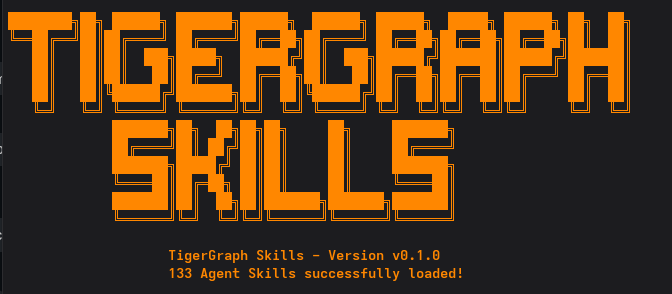

# TigerGraph Skills Monorepo 🐅⚡



[](#complete-skills-directory-133-skills)

Welcome to the **TigerGraph Skills Monorepo**. This repository contains a comprehensive collection of **133 individually installable Agent Skills** for TigerGraph, designed for AI coding agents (Claude Code, Cursor, Windsurf, OpenCode) via the community `npx skills` convention.

Each skill under `skills/` provides structured, verified instructions, prerequisites, step-by-step guides, efficiency benchmarks (GSQL vs. SQL & GraphRAG vs. Vector RAG), common mistakes, and official source links for TigerGraph Savanna, Cloud Classic, and self-managed/Docker deployments.


---

## 🚀 Installation & Usage

You can install skills directly from this GitHub repository using `npx skills`:

```bash
# List all available skills in this repository
npx skills add Srizdebnath/TigerGraphSkills --list

# Install a specific skill (e.g. GSQL schema design)
npx skills add Srizdebnath/TigerGraphSkills --skill gsql-schema-design

# Install all 133 skills into your AI Agent environment
npx skills add Srizdebnath/TigerGraphSkills --all
```

---

## ⚡ GSQL & GraphRAG Efficiency Highlights

- **Token Consumption**: Up to **80%–95% prompt token reduction** using structured GSQL GraphRAG vs. unstructured text chunk dumping.
- **Traversal Performance**: **10x to 100x speedup** on 3+ hop queries compared to multi-table relational SQL `JOIN`s ($O(V+E)$ linear traversal vs. exponential cartesian joins).
- **Dual Support**: Fully verified code examples for **Local Docker** (`http://localhost`) and **Cloud-based** (`https://<instance>.savanna.tigergraph.com`) environments.

---

## 📊 Summary of Categories (Total: 133 Skills)

| Category | Description | Count |
| :--- | :--- | :---: |
| **1. Getting Started & Accounts** | Account setup, workspace creation, API keys, Docker & K8s installation | 10 |
| **2. Schema Design (GSQL DDL)** | Vertices, edges, composite keys, online schema changes, multi-graph | 8 |
| **3. Data Loading** | Ingestion via CSV, S3, Kafka, Snowflake, Spark, JDBC, upsert rules | 8 |
| **4. Core GSQL Query Writing** | Queries, accumulators, SELECT, ACCUM/POST-ACCUM, multi-hop | 12 |
| **5. Performance & Tuning** | Accumulator choice, avoiding scans, indexing, distributed query tuning | 8 |
| **6. Graph Algorithms** | PageRank, Louvain, SSSP, Jaccard, Cosine, kNN, FastRP, UDFs | 15 |
| **7. Multi-Language Querying** | openCypher, ISO GQL, language interop, syntax translation | 5 |
| **8. pyTigerGraph** | Local Docker & Cloud connections, auth, Pandas, async, GDS | 8 |
| **9. GraphQL Service** | GraphQL setup, schema generation, queries, mutations, security | 5 |
| **10. REST++ / API** | Token auth, running queries, JSON upserts/deletes, endpoints | 6 |
| **11. GraphStudio & Admin Portal** | Visual schema designer, mapping, loading, monitoring, RBAC | 6 |
| **12. Insights (Dashboarding)** | Setup, query widgets, dashboard design, sharing, optimization | 5 |
| **13. Solution Kits** | Fraud detection, entity resolution, customer 360, recommendations, mules | 5 |
| **14. Security & Governance** | RBAC, SSL/TLS, LDAP/SSO, audit logs, multi-tenancy, key rotation | 6 |
| **15. DevOps & Infrastructure** | `gadmin`, backup/restore, Grafana, CI/CD, cluster expansion, logs | 8 |
| **16. Migration** | Cloud Classic to Savanna, SQL to Graph, Neo4j to TigerGraph, upgrades | 4 |
| **17. AI & GraphRAG** | GraphRAG setup, hybrid retrieval, LLM query generation, ML Workbench | 5 |
| **18. Developer Tooling** | VS Code GSQL extension, Giraffle build tool, schema extractors | 4 |
| **19. Troubleshooting & FAQ** | Connection errors, GSQL compile errors, timeouts, community gotchas | 5 |
| **TOTAL** | | **133** |

---

## 📚 Complete Skills Directory (133 Skills)

### 1. Getting Started & Accounts (10)
- `savanna-create-account`: Creating a TigerGraph Savanna Account
- `savanna-create-workspace`: Creating a Savanna Workspace
- `savanna-api-keys`: Managing API Keys in TigerGraph Savanna
- `savanna-connect-graphstudio`: Connecting to Savanna with GraphStudio
- `savanna-connect-gsql-client`: Connecting via the GSQL Web Shell/Client
- `savanna-free-tier`: Understanding Savanna Free Tier Limits
- `savanna-byoc`: Bring Your Own Cloud (BYOC) Setup Overview
- `enterprise-install-docker`: Installing TigerGraph Enterprise via Docker
- `enterprise-install-kubernetes`: Installing TigerGraph via Kubernetes Operator
- `enterprise-install-bare-metal`: Installing TigerGraph on Bare Metal / VMs

### 2. Schema Design (GSQL DDL) (8)
- `gsql-vertex-design`: Designing GSQL Vertices
- `gsql-edge-design`: Designing GSQL Edges
- `gsql-schema-change`: Modifying Graph Schema Online
- `gsql-multi-graph`: Creating and Managing Multiple Graphs
- `gsql-discriminator`: Using Discriminator and Composite Keys
- `gsql-tuple-user-defined-types`: User-Defined Tuples in GSQL Schema
- `gsql-schema-export`: Exporting Graph Schema DDL
- `gsql-schema-best-practices`: Graph Modeling Best Practices

### 3. Data Loading (8)
- `gsql-loading-job-csv`: Loading CSV Data using GSQL
- `gsql-loading-job-s3`: Loading Data from Amazon S3
- `gsql-loading-job-kafka`: Streaming Data from Apache Kafka
- `gsql-loading-snowflake`: Loading Data from Snowflake
- `gsql-loading-spark`: Ingesting Data using Apache Spark
- `gsql-loading-db-jdbc`: Ingesting Data via JDBC/Relational DBs
- `gsql-loading-error-handling`: Troubleshooting Ingestion & Loading Errors
- `gsql-loading-upsert-rules`: Configuring Vertex and Edge Upsert Rules

### 4. Core GSQL Query Writing (12)
- `gsql-create-query`: Creating and Running GSQL Queries
- `gsql-accumulators-basic`: Basic GSQL Accumulators
- `gsql-accumulators-collection`: Collection Accumulators in GSQL
- `gsql-accumulators-advanced`: Advanced GSQL Accumulators
- `gsql-select-statement`: The GSQL SELECT Statement
- `gsql-accum-clause`: Using the ACCUM Clause
- `gsql-post-accum-clause`: Using the POST-ACCUM Clause
- `gsql-multi-hop`: Writing Multi-Hop Traversals
- `gsql-subqueries`: Writing GSQL Subqueries
- `gsql-parameterized-queries`: Parameterized Queries in GSQL
- `gsql-control-flow`: GSQL Control Flow & Loops
- `gsql-built-in-functions`: Built-In GSQL Functions

### 5. Performance & Efficient GSQL (8)
- `gsql-perf-accumulator-choice`: Optimizing Accumulator Performance
- `gsql-perf-avoid-scans`: Avoiding Full-Graph Scans in GSQL
- `gsql-perf-secondary-indexes`: Creating and Using Secondary Indexes
- `gsql-perf-distributed-queries`: Optimizing Distributed GSQL Queries
- `gsql-perf-profiling`: Profiling GSQL Queries
- `gsql-perf-batching`: Batching Query Processing
- `gsql-perf-memory-tuning`: Tuning GSQL Query Memory Limits
- `gsql-perf-workspace-sizing`: Sizing Savanna Workspaces for OLTP/OLAP

### 6. Graph Algorithms (15)
- `algo-pagerank`: Running PageRank Centrality
- `algo-closeness`: Running Closeness Centrality
- `algo-betweenness`: Running Betweenness Centrality
- `algo-eigenvector`: Running Eigenvector Centrality
- `algo-label-propagation`: Running Label Propagation
- `algo-louvain`: Running Louvain Community Detection
- `algo-connected-components`: Running Connected Components
- `algo-shortest-path`: Running Single-Source Shortest Path (SSSP)
- `algo-all-pairs-shortest-path`: Running All-Pairs Shortest Path (APSP)
- `algo-jaccard-similarity`: Running Jaccard Similarity
- `algo-cosine-similarity`: Running Cosine Similarity
- `algo-knn`: Running k-Nearest Neighbors (kNN)
- `algo-random-projection`: Running Fast Random Projection
- `algo-install-library`: Installing GSQL Graph Algorithm Library
- `algo-custom-udf`: Compiling Custom C++ UDFs

### 7. Multi-Language Query Support (5)
- `multi-lang-opencypher-savanna`: Running openCypher on TigerGraph
- `multi-lang-gql-savanna`: Using ISO GQL Standard on Savanna
- `multi-lang-interop`: GSQL, openCypher, and GQL Interoperability
- `multi-lang-opencypher-syntax`: openCypher to GSQL Syntax Translation
- `multi-lang-gql-syntax`: GQL to GSQL Syntax Translation

### 8. pyTigerGraph (8)
- `pytigergraph-connect`: Connecting with pyTigerGraph (Local Docker & Cloud)
- `pytigergraph-auth`: Authentication in pyTigerGraph
- `pytigergraph-schema`: Managing Schemas via pyTigerGraph
- `pytigergraph-queries`: Running Queries with pyTigerGraph
- `pytigergraph-pandas`: Pandas Data Ingestion & Extraction
- `pytigergraph-async`: Asynchronous Operations in pyTigerGraph
- `pytigergraph-gds`: Using pyTigerGraph GDS Loaders
- `pytigergraph-troubleshooting`: Troubleshooting pyTigerGraph Connections

### 9. GraphQL Service (5)
- `graphql-setup`: Setting up the GraphQL Service
- `graphql-schema-generation`: GraphQL Schema Generation
- `graphql-query-patterns`: Querying Graph Data via GraphQL
- `graphql-mutations`: GraphQL Mutations in TigerGraph
- `graphql-auth-security`: Securing GraphQL Endpoints

### 10. REST++ / API (6)
- `rest-auth`: REST++ Authentication & Token Management
- `rest-query`: Invoking Queries via REST++
- `rest-data-upsert`: Upserting Data via REST++
- `rest-data-delete`: Deleting Graph Data via REST++
- `rest-built-in-endpoints`: Using Built-In REST++ Endpoints
- `rest-error-handling`: Interpreting REST++ Error Codes

### 11. GraphStudio & Admin Portal (6)
- `graphstudio-schema-designer`: Visual Schema Design with GraphStudio
- `graphstudio-mapping`: Visual Data Mapping in GraphStudio
- `graphstudio-loading`: Visual Data Loading & Monitoring
- `graphstudio-query-builder`: Visual Query Writing & GSQL Editor
- `admin-portal-monitoring`: System Monitoring via Admin Portal
- `admin-portal-user-management`: Visual User Management in Admin Portal

### 12. Insights (Dashboarding) (5)
- `insights-setup`: Setting up TigerGraph Insights
- `insights-widget-query`: Binding GSQL Queries to Insights Widgets
- `insights-dashboard-design`: Designing Interactive Dashboards
- `insights-sharing-security`: Sharing Dashboards & Securing Access
- `insights-best-practices`: Insights Design & Performance Optimization

### 13. Solution Kits (5)
- `kit-fraud-detection`: Adapting the Fraud Detection Kit
- `kit-entity-resolution`: Adapting the Entity Resolution Kit
- `kit-customer-360`: Adapting Customer 360 Solution Kit
- `kit-recommendation`: Adapting the Recommendation Kit
- `kit-mule-account`: Adapting Mule Account Detection Kit

### 14. Security & Governance (6)
- `security-rbac`: Configuring Role-Based Access Control
- `security-encryption`: Configuring SSL/TLS & Encryption
- `security-single-sign-on`: Configuring LDAP and Single Sign-On
- `security-audit-logging`: Enabling & Reading Audit Logs
- `security-multitenancy`: Designing Multi-Tenant Graph Architectures
- `security-key-rotation`: Rotating Secrets & Credentials

### 15. DevOps & Infrastructure (8)
- `devops-gadmin-basics`: Managing Services with gadmin
- `devops-backup-restore`: Database Backup and Recovery
- `devops-monitoring-grafana`: Monitoring with Grafana & Prometheus
- `devops-ci-cd-schema`: CI/CD for Graph Schema Migrations
- `devops-ci-cd-queries`: CI/CD for GSQL Query Deployments
- `devops-cluster-expansion`: Scaling and Cluster Expansion
- `devops-log-rotation`: Log Management and Rotation
- `devops-recovery-failure`: Node Failure and Automatic Recovery

### 16. Migration (4)
- `migration-cloud-classic-savanna`: Migrating to TigerGraph Savanna
- `migration-relational-to-graph`: Migrating Relational Data to Graph
- `migration-neo4j-tigergraph`: Migrating from Neo4j to TigerGraph
- `migration-version-upgrade`: Upgrading TigerGraph Versions

### 17. AI & GraphRAG (5)
- `ai-graphrag-setup`: Setting up TigerGraph GraphRAG
- `ai-hybrid-retrieval`: Implementing Hybrid Search Retrieval (GraphRAG)
- `ai-llm-query-generation`: LLM-Assisted GSQL Query Generation
- `ai-graph-enrichment`: Graph Enrichment using LLMs
- `ai-ml-workbench`: Integrating TigerGraph ML Workbench

### 18. Developer Tooling (4)
- `tooling-vscode-gsql`: VS Code GSQL Extension Setup
- `tooling-giraffle-build`: Using the Giraffle Build Tool
- `tooling-schema-extractor`: Using the GSQL Schema Extractor
- `tooling-awesome-ecosys`: Discovering Community Tools

### 19. Troubleshooting & FAQ (5)
- `trouble-connection-refused`: Fixing Connection Refused Errors
- `trouble-gsql-compile-errors`: Fixing GSQL Compiler Errors
- `trouble-savanna-limits`: Understanding Savanna Limits & Quotas
- `trouble-query-timeout`: Fixing Query Timeout and Memory Errors
- `trouble-community-gotchas`: Top Community Gotchas & Solutions


